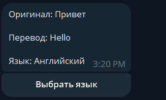
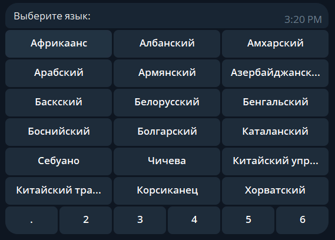

# БОТ-ПЕРЕВОДЧИК ДЛЯ ТЕЛЕГРАМ

Бот написан на основе библиотеки pyTelegramBotAPI, версии  4.14.0.

Для перевода используется библиотека googletrans, версии  3.1.0a0.

## Работа бота

1. При первом запуске бота командой `/start`, пользователь видит приветственное сообщение.

    После чего пользователь может начинать переводить текст, просто написав его в диалог. 

2. Бот переводит текст и показывает, на какой язык.

    
    
    Изначальным языком для перевода явялется английский. 

3. Для смены языка можно нажать на кнопку __Выбрать язык__
    
    Перед пользователем появится 6 страниц с доступными языками.

    

    Новый выбранный язык сохраняется до следующей смены.